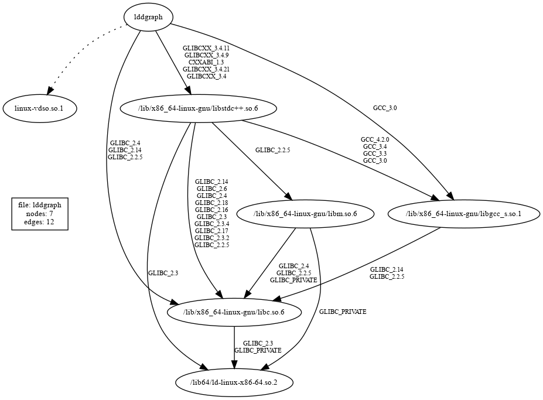

### NAME
lddgraph - convert shared object dependencies into a directed graph

### SYNOPSIS
```
   lddgraph <dynamically-loadable-file> | dot -Tpng > g.png; eog g.png
   lddgraph <ldd-output-file> | dot -Tpng > g.png; eog g.png
   cat <ldd-output-file> | lddgraph - | dot -Tpng > g.png; eog g.png
```

### DECRIPTION
Examine the dynamically loaded executable or shared object file given as an
argument, or the output of running ldd -v in a file argument or stdin
(with - argument), and emit a graphviz directed graph DOT file on stdout.

The output DOT file may be passed to the 'dot' command to plot it into a
displayable format.

Dashed lines are direct loader dependencies, at the top of the ldd -v
listing - they show all the things ld.so will load along with the
root executable or shared object.

Solid lines are the versioned symbol requirement dependencies.

### OPTIONS
```
   -    read ldd -v output on stdin 
   -?   provide help message
```

### EXAMPLES
The following:
```
   ./lddgraph lddgraph | dot -Tpng -Gsize="800,600" \
      -Nfontsize=10 -Efontsize=8 > img/lddgraph.png
```
Produces output like this:



```
   lddgraph /bin/bash | dot -Tpng > g.png && eog g.png
   lddgraph /usr/lib/libgdal.so | dot -Tpng > g.png; eog g.png
   ldd -v /bin/uname | lddgraph - | dot -Tpng > g.png; eog g.png
```

### BUGS
Same issues as ldd has.

### SEE ALSO
ld.so(8), ldconfig(8), ldd(8), dot(1), graphviz(7)

### COMPILE WITH
```
c++ -std=c++98 -o lddgraph lddgraph.cpp
```

### AUTHOR
James Perkins, 19 April 2021

### LICENSE
MIT
